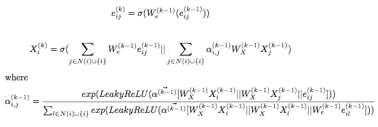
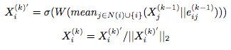

Dependencies
------------
- torch v1.0: the autograd support for sparse mm is only available in v1.0.
- requests
- sklearn
- tensorflow (for tensorboard)
```bash
$ pip install -r requirements.txt
```

```bash
$ pip install torch==1.0.0 requests
$ pip install dgl
$ pip install tensorboardX
```

```bash
# download eth dataset
$ mkdir data
$ cd data
$ curl https://transfer.sh/c9ZKx/eth.tar.gz -o eth.tar.gz  # md5: 674f5875c8d2271fcd5f36607194762e
$ tar -zxvf eth.tar.gz
```


| model               | node attr. |                   edge attr. | ETH accuracy | Drugs accuracy |
|---------------------|:----------:|-----------------------------:|--------------|----------------|
| EdgePropAT          |    yes     |                          yes | **0.9355**   | -              |
| EdgePropAT          |     no     |                          yes | 0.8065       | **0.9743**     |
| Edge prop + GIN     |    yes     |                          yes |              |                |
| Edge prop + SAGE    |    yes     |                          yes |              |                |
| GAT Edge attention  |    yes     | yes(only used for attention) | 0.8602       | -              |
| GAT Edge attention  |     no     | yes(only used for attention) | 0.4370       | 0.8719         |
| GAT                 |    yes     |                           no | 0.8302       | -              |
| Deep Graph Infomax  |    yes     |                           no |              | -              |
| Edge2Vec            |     no     |                          yes |              | 0.7554         |
| Logistic regression |    yes     |                           no | 0.8495       | -              |
| Random Forest       |    yes     |                           no | 0.9247       | -              |
| SVM (rbf)           |    yes     |                           no | 0.8172       | -              |
| KNN                 |    yes     |                           no | 0.8495       | -              |

# Command line
| parameter    | description                                                                            | type |
|--------------|----------------------------------------------------------------------------------------|------|
| dataset      | eth / drug/ simple                                                                     | str  |
| model_dir    | Directory containing params.json                                                       | str  |
| restore_file | Optional, name of the file in --model_dir containing weights to reload before training | int  |

# EdgePropAT


JSON configuration file:

| parameter     | description                         | type    |
|---------------|-------------------------------------|---------|
| gpu           | which GPU to use. Set -1 to use CPU | int     |
| epochs        | number of training epochs           | int     |
| num_heads     | number of hidden attention heads    | int     |
| num_out_heads | number of output attention heads    | int     |
| num_layers    | number of hidden layers             | int     |
| num_hidden    | number of hidden units              | int     |
| residual      | use residual connection             | int     |
| in_drop       | input feature dropout               | float   |
| attn_drop     | attention dropout                   | float   |
| lr            | learning rate                       | float   |
| weight_decay  | weight decay                        | float   |
| alpha         | the negative slop of leaky relu     | float   |
| fastmod       | skip re-evaluate the validation set | boolean |


## with node features
```bash
python main.py --dataset simple --model-dir ./experiments/edgepropAT/
```
<!-- ```bash
python train.py \
--gpu=0 \
--epochs 10000 \
--num-heads 2 \
--num-hidden 5 \
--in-drop 0 \
--attn-drop 0 \
--lr 0.0015 \
--edges_path ../data/eth/adj.csv \
--node_features_path ../data/eth/node_features.csv \
--label_path ../data/eth/label.csv \
--vertex_map_path ../data/eth/node_id_map.txt
``` -->
<!-- python train.py --gpu=1 --epochs 10000 --num-heads 1 --num-hidden 5 --in-drop 0 --attn-drop 0 --lr 0.005 --edges_path /home/handason/data/eth/adj.csv --label_path /home/handason/data/eth/label.csv --vertex_map_path /home/handason/data/eth/node_id_map.txt --node_features_path /home/handason/data/eth/node_features.csv -->

## without node features
```bash
python main.py --dataset simple --model-dir ./experiments/edgepropAT/
```

<!-- ```bash
python train.py \
--gpu=1 \
--epochs 10000 \
--num-heads 2 \
--num-hidden 5 \
--in-drop 0 \
--attn-drop 0 \
--lr 0.0015 \
--edges_path ../data/eth/adj.csv \
--label_path ../data/eth/label.csv \
--vertex_map_path ../data/eth/node_id_map.txt
```

python train.py --gpu=-1 --epochs 10000 --num-heads 2 --num-hidden 5 --in-drop 0 --attn-drop 0 --lr 0.0003 --edges_path /home/handason/data/eth/adj.csv --label_path /home/handason/data/eth/label.csv --vertex_map_path /home/handason/data/eth/node_id_map.txt --node_features_path /home/handason/data/eth/node_features.csv -->


# GAT with Edge attention


```bash
python main.py --dataset simple --model-dir ./experiments/GAT_EdgeAT/
```
<!-- ```bash

python train.py \
--dataset=cora \
--gpu=1 \
--epochs 10000 \
--num-heads 2 \
--num-hidden 5 \
--in-drop 0 \
--attn-drop 0 \
--lr 0.008 \
--dataset drug
``` -->

# GAT


```bash
python main.py --dataset simple --model-dir ./experiments/GAT/
```

<!-- ```bash
python train.py \
--gpu=1 \
--num-heads 2 \
--num-hidden 5 \
--in-drop 0 \
--attn-drop 0 \
--lr 0.0005 \
--dataset drug
``` -->

<!-- # EdgePropSAGE

```bash
python main.py --dataset simple --model-dir ./experiments/GAT/
``` -->
<!-- ```bash

python train.py \
--dataset=cora \
--gpu=1 \
--epochs 10000 \
--num-heads 2 \
--num-hidden 5 \
--in-drop 0 \
--attn-drop 0 \
--lr 0.008 \
--edges_path ../data/eth/adj.csv \
--node_features_path ../data/eth/node_features.csv \
--label_path ../data/eth/label.csv \
--vertex_map_path ../data/eth/node_id_map.txt \
--dataset drug
```
 -->
