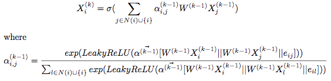

```

How to run
----------

Run with following:

```bash

python train.py \
--dataset=cora \
--gpu=1 \
--epochs 10000 \
--num-heads 2 \
--num-hidden 5 \
--in-drop 0 \
--attn-drop 0 \
--lr 0.008 \
--edges_path ../data/eth/adj.csv \
--node_features_path ../data/eth/node_features.csv \
--label_path ../data/eth/label.csv \
--vertex_map_path ../data/eth/node_id_map.txt \
--dataset drug
```

Results
-------
max test accuracy: 0.8602