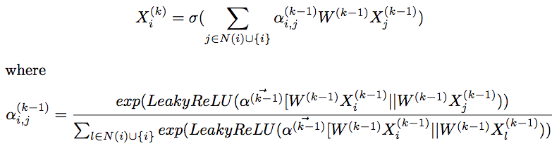

How to run
----------

Run with following:

```bash
python train.py \
--gpu=1 \
--num-heads 2 \
--num-hidden 5 \
--in-drop 0 \
--attn-drop 0 \
--lr 0.0005 \
--edge_attr_directory ../data/eth/edges \
--node_features_path ../data/eth/node_features.csv \
--label_path ../data/eth/label.csv
--vertex_map_path ../data/eth/node_id_map.txt
```

Results
-----------
Max Test accuract: 0.8302